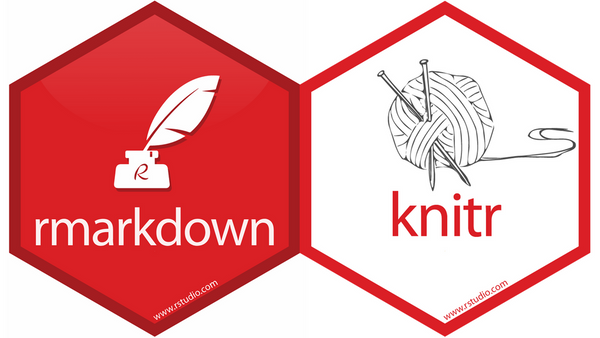

# BADGES

Este es un repositorio con código para poner los distintos logos de las librerias así como sus versiones.

Una parte importante del proceso de desarrollo de paquetes es la comprobación de R CMD. R CMD check verifica automáticamente su código en busca de problemas comunes. Es esencial si planea enviar a CRAN, pero es útil incluso si no es así porque detecta automáticamente muchos problemas comunes que de otro modo descubriría de la manera más difícil.

La cobertura de código es una técnica de prueba que informa qué código se prueba y qué código no se prueba. A menudo se representa como un porcentaje de la cantidad de líneas de código que se prueban en comparación con la base de código completa.

CRAN es una red de servidores ftp y web en todo el mundo que almacenan versiones idénticas y actualizadas de código y documentación para R. Utilice el espejo CRAN más cercano para minimizar la carga de la red.

# ggplot2 

ggplot2 es un sistema para crear gráficos declarativamente, basado en The Grammar of Graphics. Usted proporciona los datos, le dice a ggplot2 cómo asignar variables a la estética, qué primitivas gráficas usar y se ocupa de los detalles.

<!-- badges: start -->

<!-- badges: end -->

# Rmarkdown+Knitr 

R Markdown proporciona un marco de creación para la ciencia de datos. Puede usar un solo archivo R Markdown para ambos
guardar y ejecutar código generar informes de alta calidad que se pueden compartir con una audiencia
Los documentos de R Markdown son totalmente reproducibles y admiten docenas de formatos de salida estáticos y dinámicos. 

El paquete knitr es una implementación de Literate Programming, un paradigma de programación que
entremezclar fragmentos de código (para computación) con prosa (para documentación) en el mismo documento.
Detalles
Cuando se compila el documento, los fragmentos de código se pueden ejecutar y los resultados de la computación
(texto o gráficos) se escriben automáticamente en la salida junto con el texto.
Este paquete es una herramienta alternativa a Sweave con un diseño más flexible y nuevas características como
almacenamiento en caché y un control más preciso de los gráficos. No se limita a LaTeX y está listo para ser personalizado
para procesar otros formatos de archivo.

<!-- badges: start -->

<!-- badges: end -->

# Tidyverse 

The core tidyverse includes the packages that you’re likely to use in everyday data analyses. As of tidyverse 1.3.0, the following packages are included in the core tidyverse:

https://www.tidyverse.org/packages/#core-tidyverse

<!-- badges: start -->

<!-- badges: end -->
